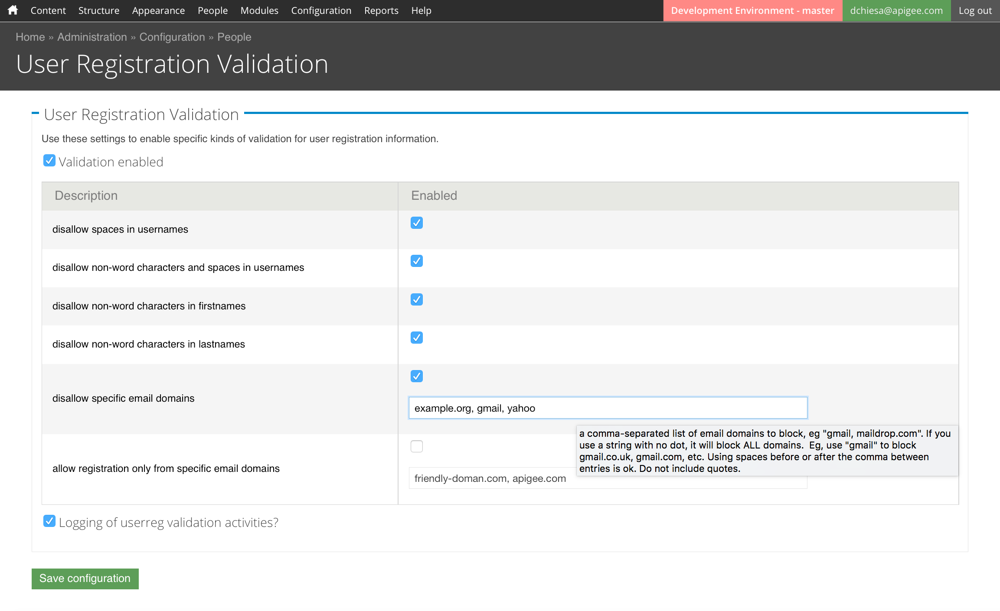

# Drupal-User-Registration-Validation

This module validates information submitted on the user registration form.
There are some hard-coded checks:

- disallow spaces in usernames
- disallow non-word characters and spaces in usernames
- disallow non-word characters in firstnames
- disallow non-word characters in lastnames
- apply a blacklist: disallow specific email domains (admin specifies)
- apply a whitelist: allow registration only from specific email domains (admin specifies)

To configure how the validation is done, there is an Administrative configuration panel under
  Admin > Config > People > User Registration Validation

It looks like this:

## Modifying the checks

If you'd like to modify the checks, you can look in [functions.inc](functions.inc) for the `dpchiesa_validate_userreg_available_checks` function.  Add or remove checks there, following the pattern.  You should be able to figure it out.

